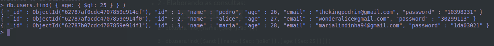
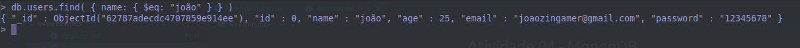
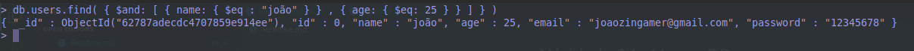
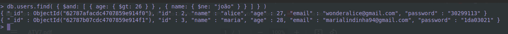
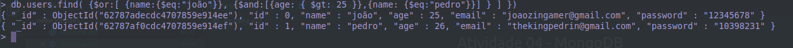

<h1 align="center"> Atividade 04 - MongoDB</h1>

-   <h2>Populando a base de dados:</h2>

    ```js
    db.users.insert({
        id: 0,
        name: 'joão',
        age: 25,
        email: 'joaozingamer@gmail.com',
        password: '12345678',
    });
    ```

    ```js
    db.users.insert({
        id: 1,
        name: 'pedro',
        age: 26,
        email: 'thekingpedrin@gmail.com',
        password: '10398231',
    });
    ```

    ```js
    db.users.insert({
        id: 2,
        name: 'alice',
        age: 27,
        email: 'wonderalice@gmail.com',
        password: '30299113',
    });
    ```

    ```js
    db.users.insert({
        id: 3,
        name: 'maria',
        age: 28,
        email: 'marialindinha94@gmail.com',
        password: '1da03021',
    });
    ```

-   <h2>Elaborando as consultas:</h2>

    <span style="font-size:18px">1 - Obtenha todos usuários que tenham mais de 25 anos:</span>

    ```js
    db.users.find({ age: { $gt: 25 } });
    ```

    <span style="font-size:18px">resultado:</span>

    

    <span style="font-size:18px">2 - Obtenha um usuário tem nome igual a “joao”:</span>

    ```js
    db.users.find({ name: { $eq: 'joão' } });
    ```

    <span style="font-size:18px">resultado:</span>

    

    <span style="font-size:18px">3 - Obtenha todos os usuários que tem nome igual a “joao” e idade igual a 25 anos:</span>

    ```js
    db.users.find({ $and: [{ name: { $eq: 'joão' } }, { age: { $eq: 25 } }] });
    ```

    <span style="font-size:18px">resultado:</span>

    

    <span style="font-size:18px">4 - Obtenha todos os usuários que tem idade maior que 26 anos e nome diferente de “joao”:</span>

    ```js
    db.users.find({ $and: [{ age: { $gt: 26 } }, { name: { $ne: 'joão' } }] });
    ```

    <span style="font-size:18px">resultado:</span>

    

    <span style="font-size:18px">5 - Obtenha todos os usuários que tem nome “joao” ou (idade maior que 25 e nome igual a “pedro):</span>

    ```js
    db.users.find({
        $or: [
            { name: { $eq: 'joão' } },
            { $and: [{ age: { $gt: 25 } }, { name: { $eq: 'pedro' } }] },
        ],
    });
    ```

    <span style="font-size:18px">resultado:</span>

    
